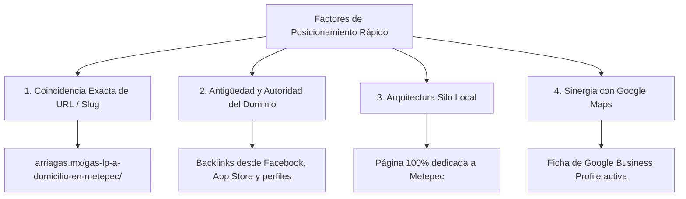
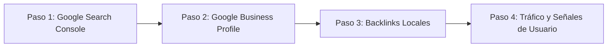

# Estrategia de Posicionamiento Rápido en Google y Análisis de Competencia

Este documento explica las razones técnicas y algorítmicas por las que páginas de la competencia como **Arriagas** logran posicionarse en Google, y define el **plan de acción paso a paso** para que **Gas LP Quiroz** ([gasmetepec.com](https://www.gasmetepec.com/)) supere a la competencia en los resultados de búsqueda.

---

## 1. ¿Por Qué Se Posiciona Rápido la Competencia (Caso Arriagas)?

El algoritmo de Google evalúa más de 200 factores para ordenar los resultados locales. En el caso de páginas como `arriagas.mx/gas-lp-a-domicilio-en-metepec/`, su posicionamiento se apoya en 4 pilares fundamentales:

### A. Coincidencia Exacta de Búsqueda (*Exact Match Keyword*)
* **URL:** `arriagas.mx/gas-lp-a-domicilio-en-metepec/`
* **Title Tag:** `Gas LP a Domicilio en Metepec | ...`
* **H1:** `Gas LP a Domicilio en Metepec`
* **Explicación:** Cuando una persona busca *"gas lp a domicilio en metepec"*, Google encuentra una coincidencia exacta de 100% entre la búsqueda del usuario, el nombre de la URL, el título de la pestaña y el encabezado principal de la página.

### B. Antigüedad y Autoridad del Dominio (*Domain Authority*)
* El dominio `arriagas.mx` tiene tiempo registrado y cuenta con enlaces entrantes (*backlinks*) desde:
  1. Su página de **Facebook** y redes sociales.
  2. Su aplicación en **Google Play Store**.
  3. Directorios comerciales del Estado de México.
* Esta trayectoria le otorga un "voto de confianza" inicial ante Googlebot, permitiendo que cualquier nueva página que publiquen sea rastreada e indexada con mayor rapidez.

### C. Estrategia de Arquitectura Silo (*Local Landing Pages*)
* Tienen su página de inicio enfocada en Toluca y crearon una URL secundaria enfocada **únicamente en Metepec**.
* Google premia la relevancia geográfica: si un usuario está físicamente en Metepec o busca "Metepec", Google prefiere mostrarle una URL especializada en Metepec antes que una página genérica.

### D. Conexión con Ficha de Google Maps (Google Business Profile)
* La interacción de los usuarios en su ficha de Google Maps (llamadas telefónicas, clics en el botón de sitio web y opiniones) envía señales directas de autoridad a Google sobre la relevancia local de la marca.

---

## 2. Comparativa Técnica: ¿Por Qué Gas LP Quiroz Puede Superarlos?

Aunque la competencia tiene antigüedad, la estructura técnica de [gasmetepec.com](file:///c:/proyectos/QuirozGasLPMetepec/index.html) está diseñada para obtener una calificación de calidad superior:

| Criterio SEO | Arriagas ([arriagas.mx](https://arriagas.mx/)) | Gas LP Quiroz ([gasmetepec.com](https://www.gasmetepec.com/)) | Ventaja para Quiroz |
| :--- | :--- | :--- | :--- |
| **Dominio** | `arriagas.mx` (Genérico) | **`gasmetepec.com`** (*Exact Match Domain*) | ⭐⭐⭐⭐⭐ Enorme ventaja: las palabras clave "gas" y "metepec" están en el propio dominio. |
| **Datos Estructurados (Schema.org)** | Esquema básico por defecto de Yoast SEO | **Grafo JSON-LD completo** (`LocalBusiness`, `GasStation`, `FAQPage`, `Rating 4.9★`, `Service`) | ⭐⭐⭐⭐⭐ Permite ganar Rich Snippets con estrellas y respuestas directas en Google. |
| **Velocidad de Carga (Core Web Vitals)** | Lenta (WordPress + Elementor + jQuery) | **Ultra rápida** (HTML5 nativo + CSS optimizado sin scripts pesados) | ⭐⭐⭐⭐⭐ Mejor experiencia móvil y preferencia en el algoritmo de indexación móvil. |
| **Retención del Usuario (*Dwell Time*)** | Baja (Texto plano sin herramientas) | **Alta** (Calculadora de litros/pesos + Selector interactivo de colonias) | ⭐⭐⭐⭐⭐ Si el usuario pasa más tiempo interactuando en la página, Google sube el ranking. |
| **Calidad y Profundidad de Contenido** | Párrafos genéricos de 1 línea | **Matriz técnica de tanques**, llenado seguro al 85%-90%, medidores PROFECO y 3 teléfonos directos | ⭐⭐⭐⭐⭐ Mayor cobertura de intenciones de búsqueda informativas y transaccionales. |

---

## 3. Plan de Acción Paso a Paso para Indexar y Posicionarse en el Top 1

Para acelerar el posicionamiento de **`gasmetepec.com`** y superar a los competidores en el menor tiempo posible, sigue estos 4 pasos esenciales:

### Paso 1: Indexación Inmediata en Google Search Console
1. Entra a [Google Search Console](https://search.google.com/search-console).
2. Agrega la propiedad: `https://www.gasmetepec.com/`.
3. Envía el archivo de mapa del sitio: `https://www.gasmetepec.com/sitemap.xml`.
4. Utiliza la herramienta **"Inspección de URLs"** introduciendo `https://www.gasmetepec.com/` y haz clic en **"Solicitar indexación"**. Esto fuerza a Googlebot a rastrear la página en un lapso de 24 a 72 horas.

### Paso 2: Vincular y Optimizar la Ficha de Google Maps (GBP)
1. En tu perfil de **Google Perfil de Negocio (Google Business Profile)** de Gas LP Quiroz:
   * Coloca en el campo **Sitio Web** el enlace exacto: `https://www.gasmetepec.com/`.
   * Agrega como categoría principal: **Proveedor de gas licuado de petróleo** / **Servicio de gas**.
   * Asegúrate de que el nombre comercial, la dirección y los teléfonos coincidan con los de la página web (722 389 1603, 722 380 0659, 720 119 6866).

### Paso 3: Construcción de Enlaces Locales (*Local Citations*)
Crea perfiles comerciales gratuitos con enlace directo a `https://www.gasmetepec.com/`:
* Página de Facebook y cuenta de Instagram de la empresa.
* Perfil de WhatsApp Business con catálogo y enlace al sitio web.
* Directorios locales como Sección Amarilla, Cylex México, Yalwa y Foursquare.

### Paso 4: Generación de Señales de Usuario y Tráfico Real
* Cada vez que un cliente solicite informes o haga un pedido por WhatsApp, compártele el enlace para cotizar en la calculadora (`https://www.gasmetepec.com/#Calculadora`).
* El tráfico real, las visitas frecuentes y la interacción con la calculadora le demuestran a Google que el sitio resuelve eficazmente la necesidad del usuario.
