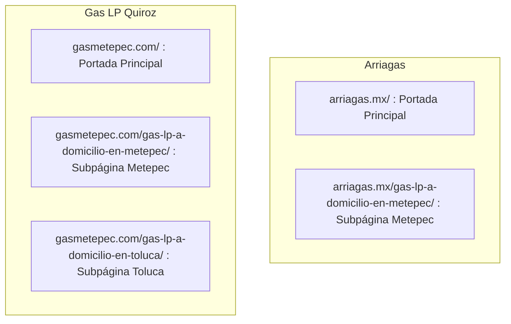

# Guía de Estructura de URLs, Subpáginas SEO y Opciones de Redirección

Este documento explica cómo funciona la estructura de URLs de tu sitio web **Gas LP Quiroz** ([gasmetepec.com](https://www.gasmetepec.com/)), por qué la competencia utiliza subpáginas y cuáles son las opciones para mostrar la URL en la barra del navegador.

---

## 1. ¿Cómo Funciona la Estructura de URLs (Raíz vs. Subpágina)?

Tanto tu sitio como el de la competencia (**Arriagas**) cuentan con dos niveles de URLs:

### Explicación:
* **Si el usuario entra solo escribiendo `gasmetepec.com`:** El navegador muestra la URL raíz `https://gasmetepec.com/`.
* **Si el usuario busca en Google o escribe la ruta completa:** El navegador muestra `https://gasmetepec.com/gas-lp-a-domicilio-en-metepec/`.

---

## 2. Tus URLs Activas y Listas en Render

Gracias a los archivos de enrutamiento que subimos a GitHub y Render ([`server.js`](file:///c:/proyectos/QuirozGasLPMetepec/server.js), [`sitemap.xml`](file:///c:/proyectos/QuirozGasLPMetepec/sitemap.xml), [`_redirects`](file:///c:/proyectos/QuirozGasLPMetepec/_redirects)), las siguientes 3 URLs están **activas y funcionando**:

1. **URL Principal de Marca:**
   `https://www.gasmetepec.com/`
2. **URL de Aterrizaje Metepec (Exact Match):**
   `https://www.gasmetepec.com/gas-lp-a-domicilio-en-metepec/`
3. **URL de Aterrizaje Toluca (Exact Match):**
   `https://www.gasmetepec.com/gas-lp-a-domicilio-en-toluca/`

> [!TIP]
> Puedes probar entrando directamente a `https://www.gasmetepec.com/gas-lp-a-domicilio-en-metepec/` desde tu navegador y verás cómo carga de inmediato mostrando ese enlace completo.

---

## 3. Opciones de Comportamiento para la Barra de Direcciones

Existen 2 formas de manejar la experiencia del usuario y el navegador:

### Opción A: Arquitectura Natural (Recomendada para SEO)
* **Cómo funciona:** 
  * Si alguien entra por `gasmetepec.com`, se queda en `gasmetepec.com`.
  * Si alguien llega desde una búsqueda de Google de *"gas lp a domicilio en metepec"*, llega a `gasmetepec.com/gas-lp-a-domicilio-en-metepec/`.
* **Ventajas:** Es el estándar de Google. Mantiene limpia la página de inicio y posiciona las subpáginas para búsquedas locales específicas.

---

### Opción B: Redirección Forzada Automática
* **Cómo funciona:**
  * Si alguien escribe en su navegador `gasmetepec.com`, el servidor automáticamente lo redirige para que la barra de direcciones cambie de inmediato a:
    `https://www.gasmetepec.com/gas-lp-a-domicilio-en-metepec/`
* **Cómo se aplica:** Se agrega una regla en el archivo `server.js` o en JavaScript para que la portada siempre adopte ese slug.

---

## 4. ¿Cómo Lograr que Google Muestre esa URL en los Resultados de Búsqueda?

Para que Google muestre la URL larga en sus resultados cuando la gente busque *"gas lp a domicilio en metepec"*:

1. **Google Search Console**:
   * Entra a [search.google.com/search-console](https://search.google.com/search-console).
   * En la barra superior de inspección, pega:
     `https://www.gasmetepec.com/gas-lp-a-domicilio-en-metepec/`
   * Haz clic en **"Solicitar indexación"**.
2. **Resultado**: Google registrará esa URL específica como el resultado principal para búsquedas en Metepec.
